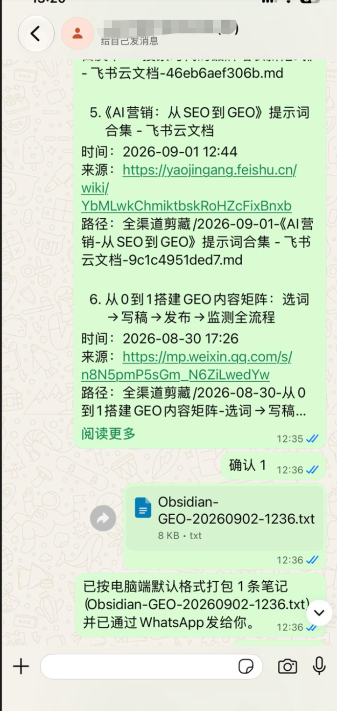
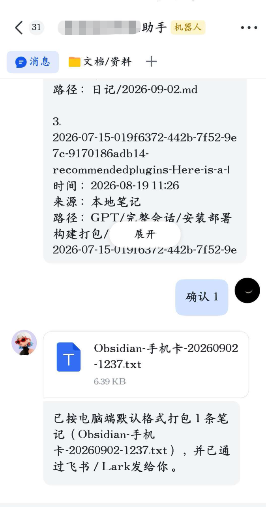

# Remote search and export

Remote search lets a connected chat bot query Markdown notes in the current desktop Vault, then pack confirmed notes on this computer.

This feature is desktop-only. Obsidian must stay open. It is off by default.

## Screenshots

The same query/confirm flow works on any connected channel. These examples are WhatsApp and Feishu/Lark.

`查 GEO` — keep a space after `查`. The bot replies immediately, then lists title, time, source, and path.

`确认 1` packs the selected note on this computer and sends an openable attachment back on WhatsApp.

The same confirmation on Feishu/Lark also returns an openable file through that channel.

## What is shared

Search, candidate confirmation, and packing are one core:

1. Send `查 关键词` or `search keyword` from an enabled channel. **A space after the command is required.** `查手机卡` or `searchkeyword` is saved as a normal diary line.
2. The plugin first replies “Searching your notes. Please wait.” / “正在查询，请稍等！”, then returns title, time, source, and path only. Note bodies are not sent before confirmation.
3. Reply `确认 1,3`, `確認 1,3`, or `confirm 1,3`. The plugin first says it is packing, then packs those candidates using the computer's default format: Markdown, plain text, Word, or PDF.
4. The plugin then tries to send an openable file through the current channel. If sending fails, the text receipt still reports that the file was generated on this computer.

Chinese, Traditional Chinese, and English commands are accepted: `查` / `查询` / `查詢` / `搜索` / `搜尋` / `search` / `query` / `find` / `lookup`, then `确认` / `確認` / `confirm`.

Do not choose a format in chat. Change **Capture rules → Remote search and export → Default export format** on the computer.

## What is not required

- Do not install another plugin.
- Do not `npm install` a channel SDK. WeChat, Feishu/Lark, DingTalk, WeCom, QQ, Slack, Telegram, Discord, and WhatsApp transports are already bundled, including file sending.
- WhatsApp may still need local Node.js 20.18+ for its isolated process. That is unrelated to packing.

## Limits

- Results expire after 2 hours.
- A query shows at most 10 candidates.
- One export packs at most 20 notes.
- Source text is limited to 5MB; the packed file is limited to 20MB.
- Sessions are isolated by channel plus sender.
- If a note changes after the query, confirmation fails and asks for a new search.

## Privacy

Until this setting is enabled, remote commands do not scan the Vault and are not written to the daily note. After it is enabled, the plugin reads Markdown in the chosen folder, packs confirmed notes locally, and sends that file through the currently connected chat channel.
